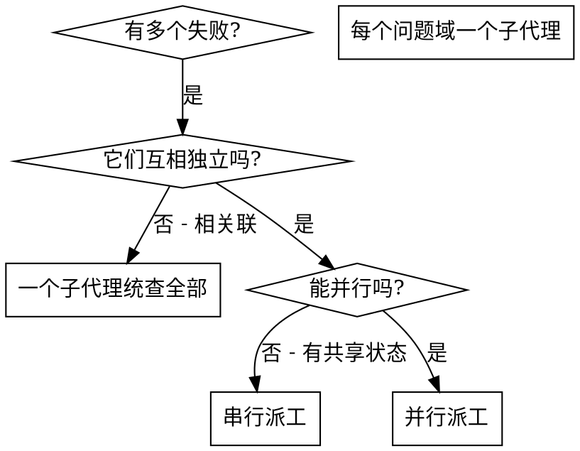

# 派子代理并行处理

## 总览

你把任务派给上下文隔离的专职子代理。子代理不继承你这轮会话的历史和上下文——你为它精确构造它需要的一切:范围、目标、约束、产出格式。指令越精准,它越聚焦、越容易把活干成。这样做还有一个好处:把你自己的上下文留给协调工作,不被一堆细节塞满。

当你手上有多个互不相关的失败(不同测试文件、不同子系统、不同 bug),挨个串行排查是浪费时间——每个排查都是独立的,可以并行发生。

**核心原则:每个独立的问题域派一个子代理,让它们同时干活。**

## 何时使用



**适用于:**
- 3 个以上测试文件失败,且根因各不相同
- 多个子系统各自独立地坏了
- 每个问题都能脱离其他问题单独理解清楚
- 各个排查之间没有共享状态

**不要用于:**
- 失败彼此相关(修好一个可能连带修好其他)
- 需要先看懂整个系统的全局状态
- 子代理之间会互相干扰(改同一批文件、抢同一份资源)

## 标准做法

### 1. 划分独立问题域

按"坏在哪儿"把失败分组:
- 文件 A 的测试:工具审批流程
- 文件 B 的测试:批量完成行为
- 文件 C 的测试:中止功能

每个问题域彼此独立——修工具审批不影响中止测试。

### 2. 给每个子代理写聚焦的任务

每个子代理拿到:
- **明确范围**:一个测试文件或一个子系统
- **清晰目标**:让这些测试通过
- **约束**:不要动其他代码
- **产出要求**:汇报你查到了什么、改了什么

### 3. 并行派工

用 my-agent 的派工工具一次性把多个子代理建出来并行跑(`create_subagents` 建批量子代理,`dispatch_subagents` 下发,`schedule_child_subagents` 在已有任务树下挂子节点):

```
create_subagents:
  - 子代理 1 → 修 agent-tool-abort 测试的失败
  - 子代理 2 → 修 batch-completion-behavior 测试的失败
  - 子代理 3 → 修 tool-approval-race-conditions 测试的失败
# 三个同时跑
```

### 4. 收口与整合

子代理返回后:
- 逐份读它们的汇报
- 核对各自的改动 diff 不冲突
- 跑完整测试 gate(`run_command`)
- 整合全部改动,确认通过后再标记任务完成 / `submit_for_acceptance`

## 子代理指令的写法

好的子代理指令具备三点:
1. **聚焦**——一个清晰的问题域
2. **自包含**——理解这个问题所需的全部上下文都在指令里(子代理看不到你的会话历史)
3. **产出明确**——说清子代理该返回什么

示例:

```markdown
修 src/agents/agent-tool-abort 测试里的 3 个失败:

1. "中止工具时应捕获部分输出" — 期望消息里出现 'interrupted at'
2. "应处理已完成与已中止混合的工具" — 快工具被误中止,本应完成
3. "应正确跟踪 pendingToolCount" — 期望 3 条结果却拿到 0 条

这些是时序 / 竞态问题。你的任务:

1. 读测试文件,弄清每个用例在验证什么
2. 定位根因——是时序问题还是真 bug?
3. 这样修:
   - 把写死的固定超时换成基于事件的等待
   - 如发现中止实现里的 bug 就修掉
   - 如果是被测行为本身变了,就调整测试预期

不要只靠调大超时蒙混过去——找到真正的问题。

返回:你查到了什么、改了什么的汇报。
```

## 常见错误

| 反例 | 正解 |
| --- | --- |
| ❌ **太宽**:"把所有测试都修了" — 子代理会迷失 | ✅ **具体**:"修 agent-tool-abort 测试" — 范围聚焦 |
| ❌ **没上下文**:"修那个竞态" — 子代理不知道在哪儿 | ✅ **带上下文**:把报错信息和用例名贴进去 |
| ❌ **没约束**:子代理可能把一切都重构了 | ✅ **给约束**:"不要改业务代码" 或 "只修测试" |
| ❌ **产出含糊**:"修一下" — 你不知道它改了啥 | ✅ **指定产出**:"返回根因和改动清单的汇报" |

## 何时不要用

- **失败相关联**:修一个可能连带修好其他——先一起排查
- **需要全局上下文**:理解问题必须看到整个系统
- **探索式调试**:你还不知道到底坏在哪
- **有共享状态**:子代理会互相干扰(改同一批文件、抢同一份资源)

## 完整示例

**场景:** 一次大重构后,3 个文件里冒出 6 个测试失败。

**失败:**
- agent-tool-abort 测试:3 个失败(时序问题)
- batch-completion-behavior 测试:2 个失败(工具没执行)
- tool-approval-race-conditions 测试:1 个失败(执行计数为 0)

**判断:** 独立问题域——中止逻辑、批量完成、竞态三者互不相干。

**派工:**
```
子代理 1 → 修 agent-tool-abort 测试
子代理 2 → 修 batch-completion-behavior 测试
子代理 3 → 修 tool-approval-race-conditions 测试
```

**结果:**
- 子代理 1:把固定超时换成基于事件的等待
- 子代理 2:修掉事件结构 bug(threadId 放错了位置)
- 子代理 3:补上对异步工具执行完成的等待

**整合:** 三处改动互相独立,无冲突,完整 gate 全绿。

**收益:** 3 个问题并行解决,而非串行耗时。

## 核心收益

1. **并行**——多个排查同时进行
2. **聚焦**——每个子代理范围窄,要跟踪的上下文少
3. **独立**——子代理之间互不干扰
4. **快**——用 1 个问题的时间解决 3 个问题

## 验收(子代理返回后必做)

并行省时,但子代理可能犯系统性错误,收口这一关不能省:

1. **逐份读汇报**——弄清每个子代理改了什么
2. **查冲突**——是否有子代理动了同一处代码
3. **跑完整 gate**——确认所有改动放在一起仍然通过
4. **抽查**——别全信汇报,挑关键改动核对实际 diff,确认没有"声称完成"但实际没改到位的情况

只有完整 gate 全绿、抽查无误,才用 `task_progress` 更新进度并标记任务完成 / `submit_for_acceptance`。过程中遇到阻塞或需要上报的事件,用 `raise_event` 抛出。
