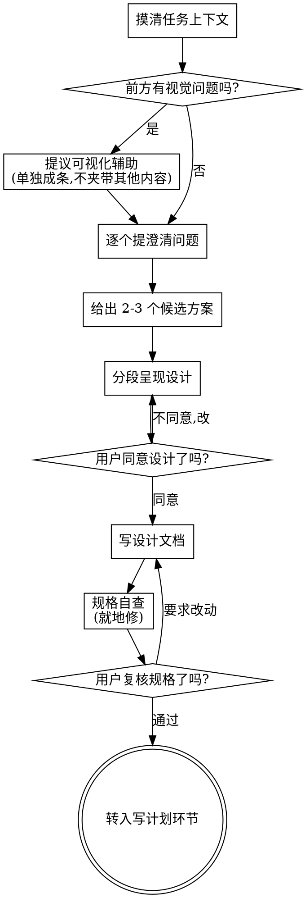

# 把想法打磨成设计

通过自然的协作对话,帮助用户把一个模糊想法变成成形的设计和规格。

先理解当前任务的上下文,再一次问一个问题逐步收敛想法。等你真正搞清楚要做什么了,把设计呈现给用户,逐段拿到确认。

<硬门禁>
在你呈现出一份设计、并且用户明确同意之前,**不准**调用任何实现类 skill、不准写任何代码、不准搭项目骨架、不准做任何实现动作。这条对**每一个**任务都成立,不管它看起来多简单。
</硬门禁>

## 反模式:"这太简单了,不需要设计"

每个任务都走这个流程。一个待办清单、一个单函数小工具、一处配置改动——全都要走。恰恰是"简单"任务,最容易因为没被检验的假设而做白工。设计可以很短(真正简单的任务,几句话就够),但你**必须**把它说出来并拿到确认。

## 检查表

下面每一项都要登记进同一份 `task_progress` 清单，并按顺序完成:

1. **摸清任务上下文** —— 看相关文件、文档、最近的改动记录
2. **提议可视化辅助**(如果话题会涉及视觉问题) —— 这要单独发一条消息,不要和澄清问题混在一起。见下文"可视化辅助"一节。
3. **逐个提澄清问题** —— 一次一个,搞清楚目的 / 约束 / 成功标准
4. **给出 2-3 个候选方案** —— 带各自的取舍,并给出你的推荐
5. **呈现设计** —— 按各部分的复杂度分段呈现,每段之后拿用户确认
6. **写设计文档** —— 存到 `docs/specs/YYYY-MM-DD-<主题>-design.md`,随任务收尾一并提交
7. **规格自查** —— 快速就地检查占位符、自相矛盾、歧义、范围(见下文)
8. **用户复核成文规格** —— 在继续之前,请用户复核规格文件
9. **过渡到实现** —— 转入"写计划"环节,产出实现计划

## 流程图

**终点是转入"写计划"环节。** 在头脑风暴之后,你唯一该转入的就是产出实现计划这一步,不要直接跳进任何具体实现动作。

## 具体怎么做

**理解想法:**

- 先看一眼当前任务的状态(相关文件、文档、最近的改动记录)
- 在问细节之前先评估规模:如果需求描述的是多个互相独立的子系统(比如"做一个带聊天、文件存储、计费、分析的平台"),立刻指出来。别把问题花在打磨一个本该先拆解的项目的细节上。
- 如果项目大到一份规格装不下,帮用户拆成子项目:有哪些独立的部分、它们之间什么关系、应该按什么顺序做?然后照常规设计流程对第一个子项目做头脑风暴。每个子项目各自走一遍"规格 → 计划 → 实现"的循环。用 `task_progress(action=update)` 把拆出来的子项目登记为 items,必要时用 `create_subagents` 创建不同分工并自动并行推进。
- 对于规模合适的项目,一次问一个问题来收敛想法
- 能用选择题就尽量用选择题,但开放式提问也可以
- 一条消息只问一个问题——如果一个话题需要更多探讨,拆成多个问题
- 聚焦在理解上:目的、约束、成功标准

**探索方案:**

- 提出 2-3 个不同方案,各自带取舍
- 用对话的方式呈现选项,并给出你的推荐和理由
- 先抛你推荐的那个,并解释为什么

**呈现设计:**

- 当你认为已经搞清楚要做什么了,把设计呈现出来
- 每一部分的篇幅跟着它的复杂度走:直白的几句话,微妙的可以写到 200-300 字
- 每呈现一段,就问一句"到这里看着对吗?"
- 覆盖:架构、各组件、数据流、错误处理、测试
- 一旦有什么讲不通,随时准备回头澄清

**为隔离和清晰而设计:**

- 把系统拆成更小的单元,每个单元只承担一个明确的职责、通过定义清楚的接口通信、可以被独立地理解和测试
- 对每个单元,你都该答得上来:它做什么、怎么用、依赖谁
- 不读内部实现,能不能看懂这个单元做什么?改它的内部实现,会不会弄坏调用方?如果不能,边界就还得再划。
- 更小、边界更清的单元,你自己处理起来也更顺——能一次装进上下文的代码,你推理得更准;文件聚焦时,你的改动更可靠。一个文件长到很大,往往就是它做了太多事的信号。

**在已有代码库里干活:**

- 动手改之前先摸清现有结构,沿用现有的写法和约定。
- 如果现有代码有问题、且影响到这次的活(比如某个文件长得太大、边界不清、职责纠缠),把针对性的改进作为设计的一部分纳进来——就像一个好开发者会顺手改好自己正在动的代码那样。
- 别提与本次目标无关的重构。盯住当前目标。

## 设计之后

**文档:**

- 把验证过的设计(规格)写到 `docs/specs/YYYY-MM-DD-<主题>-design.md`
  - (用户对规格存放位置另有偏好时,以用户的为准)
- 设计文档随任务收尾一并提交进改动 diff
- 写得清晰简洁,别堆话

**规格自查:**
写完规格文档后,用新鲜的眼光重看一遍:

1. **占位符扫一遍:** 有没有"待定"、"TODO"、没写完的段落、含糊的需求?修掉。
2. **内部一致性:** 各段之间有没有自相矛盾?架构描述和功能描述对得上吗?
3. **范围核查:** 这份规格是否聚焦到能装进一份实现计划?还是说它需要再拆?
4. **歧义核查:** 有没有哪条需求能被理解成两种意思?有的话,选一种并写明白。

发现问题就地修掉。不用反复重审——修完往下走。

**用户复核门禁:**
规格自查这一轮过了之后,在继续之前请用户复核成文的规格:

> "规格已写好并随任务提交到 `<路径>`。请你过一遍,如果在我们开始产出实现计划之前你想做任何改动,告诉我。"

等用户回话。如果他们要求改动,改完再跑一遍规格自查这一轮。只有用户同意了才往下走。

**实现:**

- 转入"写计划"环节,产出一份详细的实现计划
- 在那之前,不要做任何实现动作。产出实现计划是下一步。

## 核心原则

- **一次一个问题** —— 别用一堆问题把人淹了
- **优先选择题** —— 比开放式问题更好回答
- **狠抓 YAGNI** —— 把所有设计里不必要的功能砍掉
- **探索备选** —— 落定之前,总是先给 2-3 个方案
- **增量验证** —— 呈现设计、拿到确认,再往下走
- **保持灵活** —— 哪里讲不通就回头澄清

## 诚实与验证

- 设计里凡是"应该能行"的假设,只要花点代价就能验,就验(用 run_command 跑一下、跑测试 gate、看一眼真实数据/接口),别拿没核实的判断当结论。
- 没拿到用户对设计的确认,就别声称"设计完成";没让用户复核成文规格,就别推进到实现。
- 在标记任务完成、或最终回复之前,回头比对设计与实际产出:做出来的东西和当初说好的对得上吗?对不上,如实说清差在哪,别糊弄过去。
- 任务推进过程中用 task_progress 记录进展、用 raise_event 抛关键节点,让协作方看得见真实状态。

## 可视化辅助

一个基于浏览器的辅助手段,用来在头脑风暴时展示原型图、示意图和可视化的选项。它是一个**工具**,不是一种模式。接受它,意思是"对那些适合视觉呈现的问题,可以动用它";不意味着每个问题都得走浏览器。

**提议这个辅助:** 当你预判接下来的问题会涉及视觉内容(原型图、布局、示意图)时,单独提议一次以征得同意:

> "我们接下来要聊的有些东西,如果我能在网页里画给你看,可能更好讲。我可以一边聊一边做原型图、示意图、对比图之类的可视化。想试试吗?(需要打开一个本地链接)"

**这条提议必须单独成一条消息。** 不要把它和澄清问题、上下文小结或任何别的内容混在一起。这条消息里只放上面那句提议,别的什么都不放。等用户回话再继续。如果他们拒绝,就用纯文字做头脑风暴。

**逐题决定:** 即便用户同意了,也要**对每一个问题**单独判断:走浏览器还是走文字?判据是:**用户看图,会比读字更容易懂吗?**

- **走浏览器** —— 内容本身就是视觉的:原型图、线框图、布局对比、架构示意图、并排的视觉设计
- **走文字** —— 内容是文字的:需求问题、概念取舍、取舍清单、A/B/C/D 文字选项、范围决策

一个关于界面的话题,并不自动等于一个视觉问题。"这个语境下'个性'指什么?"是概念问题——走文字。"哪个向导布局更好?"是视觉问题——走浏览器。
