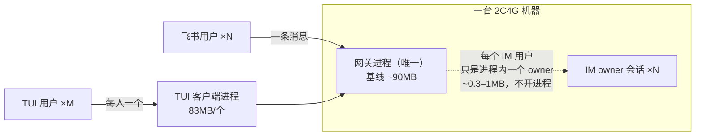
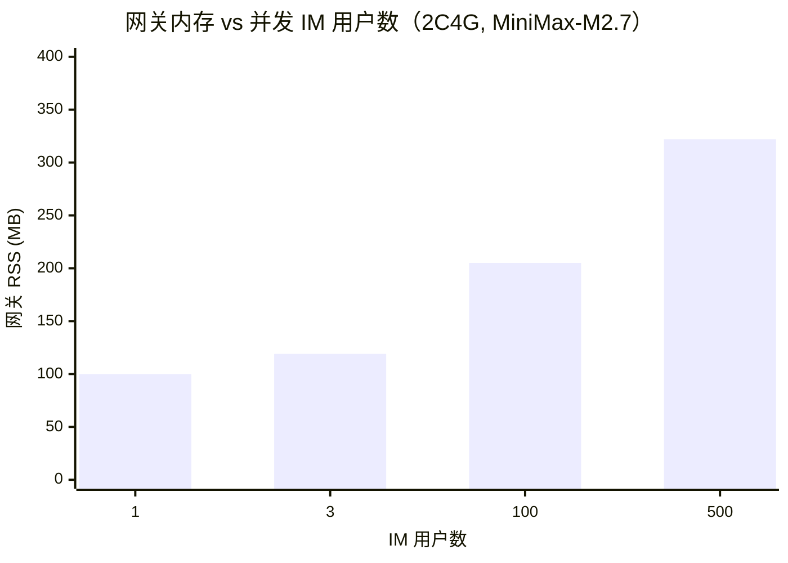

# my-agent 资源占用与并发容量基准测试报告

> 测试日期：2026-10-07
> 测试机：192.168.1.18（独立 2C4G Linux，无界面）
> 模型：MiniMax-M2.7（真实调用）
> 测试者：3a（集成者会话）
> 代码版本：当前 `origin/main`（≈ 生产运行时 17t）

---

## 摘要（TL;DR）

在一台 **2 核 / 4GB 的无界面 Linux** 上，用真实的 **MiniMax-M2.7** 调用实测得出：

| 结论 | 数字 |
|---|---|
| 一台 2C4G 能**接住的 IM 用户** | **几百到几千个**（500 个只占网关 322MB，内存几乎不是限制） |
| 一台 2C4G 能跑的 **TUI** | **约 30 个**（受限于每个 TUI 一个 83MB 客户端进程） |
| 同一刻**真正在被处理**的回合数 | **约 8 个**（受 2 核 CPU + 模型延迟限制，不是内存） |
| 一个 IM 用户的内存成本 | **约 0.3–1 MB**（在网关进程里，不开新进程） |
| 一个 TUI 的内存成本 | **83 MB**（每个 TUI 一个独立客户端进程） |

**一句话**：同样一台机器，**IM 用户能接的数量是 TUI 的上百倍**；真正的扩展瓶颈是 **CPU 和模型延迟**，不是内存。

---

## 一、测试目标

回答一个容量问题：**给一台小机器（1C2G / 2C4G），my-agent 能同时支持多少个 TUI、多少个 IM 用户？** 用真实模型（MiniMax-M2.7）跑，总 token 消耗控制在 5000 万以内。

## 二、测试环境

| 项 | 值 |
|---|---|
| 机器 | 192.168.1.18，2 vCPU，3915 MB 内存，Linux 6.8（Ubuntu），无界面 |
| 安装 | 全新从零安装：Python 3.12 venv，27 个包，209 MB；依赖全是纯 Python（无需编译） |
| 代码 | `origin/main` 7241ffd45（≈ 生产 17t） |
| 模型 | MiniMax-M2.7，`anthropic_compatible` 协议，`https://api.minimaxi.com/anthropic`，上下文窗口 262144 |
| 网关 | 私有回环端口 `127.0.0.1:18866`（未使用生产 8420 端口） |
| 每用户 owner 隔离 | 开启（`gateway_per_user_owner_scoping=true`，生产默认值） |

### 架构（为什么 TUI 和 IM 成本差这么多）



- **TUI**：每开一个 TUI，机器上多一个 **83MB 的客户端进程**。
- **IM**：每个飞书用户只是网关进程**内部**的一个 owner 会话，**不开新进程**，常驻约 **0.3–1MB**。
- 真正干活（模型调用、工具、记忆）都在**同一个网关进程**里。

## 三、单项资源基线（实测）

| 组件 | 内存 | 线程 | 备注 |
|---|---|---|---|
| 网关进程（空载） | **90 MB** | 11 | 刚启动、无会话 |
| 一个 TUI 客户端 | **83 MB** | 3 | 连到网关、空闲 |
| 一个 IM 用户（常驻、空闲） | **~0.3–1 MB** | — | 在网关进程内 |
| 一个 IM 用户（正在跑那一下） | **~9 MB** | — | 但同时只有 ~8 个在跑 |
| 一个极小任务（1 次会话） | — | — | ~23K token（22992 入 + 107 出），约 7 秒 |

### TUI vs IM 单用户内存成本对比

```
每个用户占多少内存（条越长越费）
TUI  ████████████████████████████████████████████████  83 MB（独立进程）
IM   ▌ ~1 MB（网关内，不开进程）
     └─ 差约 80 倍 ─┘
```

## 四、规模压测（真实 MiniMax 调用）

用脚本模拟 N 个不同的飞书用户，各发一条极小任务，经网关真实 ingress 入队，网关用 MiniMax-M2.7 真实处理。测量网关进程 RSS 峰值。

| 并发 IM 用户 | 网关峰值 RSS | 相对空载增量 | 全部处理完耗时 | 期间内存余量 |
|---|---|---|---|---|
| 1 | 100 MB | +10 MB | 7 s | 充足 |
| 3 | 119 MB | +27 MB | 9 s | 充足 |
| 100 | 205 MB | +115 MB | 70 s | 剩 3.2 GB |
| 500 | 322 MB | +232 MB（对空载） | ~403 s | 剩 ~3 GB |

### 网关内存随 IM 用户数的变化



```
网关 RSS (MB)
400 |
350 |                                             ■ 322（500用户）
300 |
250 |
200 |                         ■ 205（100用户）
150 |
100 |  ■ 100   ■ 119
 50 |
  0 +--------------------------------------------------
      1用户   3用户      100用户           500用户
```

**关键观察：500 个 IM 用户常驻，网关才占 322MB，内存余量始终 3GB 左右——内存根本不是瓶颈。**

### CPU 才是真正的墙

压测期间 **2 核机器的负载（load average）冲到 7–8**，说明 CPU 被打满。网关默认同时只跑 **8 个回合**（`background_owner_workers=8`），其余排队。500 个用户用了约 6.7 分钟处理完，折合**约 1–1.3 个回合/秒**的持续吞吐。

```
2 核 CPU 负载（1.0 = 一个核满载）
压测中  ████████████████ load ≈ 7–8   ← 严重过载，CPU 是瓶颈
空闲时  █ load ≈ 0.5
```

## 五、容量结论

### 2C4G（本次实测机器）

| | 能支持多少 | 卡在哪 |
|---|---|---|
| **IM 用户** | **几百到几千个"连着/在线"**（500 个仅 322MB，按斜率 3GB 可容纳数千个）；但**同一刻真正在处理约 8 个** | 内存几乎不限；真正的墙是 **CPU + 模型延迟** |
| **TUI** | **约 30 个** | **内存**（每个 TUI 一个 83MB 客户端进程） |

### 1C2G（推算）

| | 估算 | 说明 |
|---|---|---|
| **TUI** | **约 13–15 个** | 可用内存 ~1.2GB ÷ 83MB |
| **IM 用户** | **几百个连着没问题** | 内存够；1 核同一刻只能跑 ~4–8 个回合，吞吐减半 |

### 瓶颈排序

1. **CPU / 模型延迟**（最先到顶）：2 核同时只能跑 ~8 个回合。
2. **TUI 客户端进程内存**（TUI 场景的墙）：每个 83MB。
3. **网关内存**（几乎不是问题）：每个 IM 用户才 ~1MB。

## 六、边界与注意事项

- **任务是极小任务**（回两个字、不调工具）。真实任务若带工具、长上下文，单个"正在跑"的回合会更吃内存和 CPU，吞吐会更低。
- 测量时把 owner 池设成**不淘汰**（`owner_agent_idle_seconds=0`、池上限 128）以便观察峰值；**生产默认空闲 60 秒就释放**（池 64），稳态内存比本报告更低。
- 机器**无界面、无浏览器**，符合小机器部署场景；如果任务要开浏览器/编译，单任务成本会高得多。
- "可用内存"在 Linux 上 `free` 的 free 列会偏低（缓存可回收），实际可用（MemAvailable）更高；本报告以进程 RSS 为准。
- 数字来自单机、单次测试，不同机型/网络/真实流量需分别验收。

## 七、附录

### Token 用量
- 本次全部测试累计 **约 1382 万 token**（输入 1380 万 + 输出 1.6 万），占 5000 万预算的约 **28%**，未超。

### 关键并发参数（可调）
| 参数 | 默认 | 作用 |
|---|---|---|
| `background_owner_workers` | 8 | 全局同时跑几个回合（CPU 相关，小机器可调小） |
| `background_threads_per_owner` | 4 | 单用户同时跑几个会话 |
| `owner_agent_pool_max_agents` | 64 | 内存里最多常驻几个用户实例 |
| `owner_agent_idle_seconds` | 60 | 用户空闲多久释放实例 |

### 可复现步骤（摘要）
1. 新建 venv，`pip install` my-agent 源码（纯 Python 依赖）。
2. 配置 MiniMax-M2.7 为默认模型，网关设私有回环端口。
3. 启动网关，用脚本经 `submit_gateway_ask` 以不同飞书用户身份入队 N 个极小任务。
4. 采样网关进程 RSS、系统负载、完成度；读 `model_usage` 账本统计 token。

## 建议下一步

1. **接用户优先走 IM，不走 TUI**：同机 IM 密度高约 80 倍。
2. **小机器的关键是调并发回合数**（`background_owner_workers`），匹配 CPU 和模型延迟，而不是加内存。建议再测一组：把它从 8 调到 2/4/16，找出 1C2G / 2C4G 上吞吐和延迟的拐点。
3. **TUI 若要省机器**：让 TUI 客户端跑在用户自己的电脑上，服务器只跑网关（这样 TUI 用户在服务器侧也只占 ~1MB，和 IM 一样）。
4. 真实生产前，用**带工具、长上下文的真实任务**再测一轮，得到更贴近业务的单用户成本。
