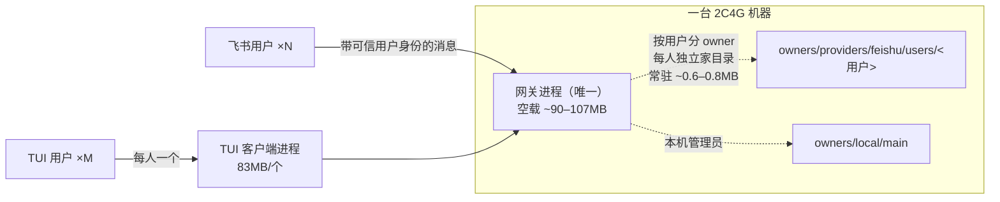
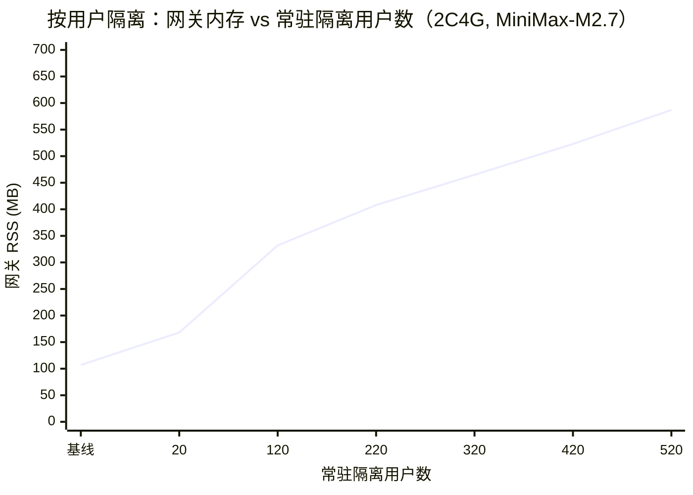

# my-agent 资源占用、并发容量与用户隔离测试报告

> 测试日期：2026-10-07 ~ 10-08
> 测试机：192.168.1.18（独立 2C4G Linux，无界面）
> 模型：MiniMax-M2.7（全部为真实调用）
> 测试者：3a（集成者会话）
> 代码版本：`origin/main` 7241ffd45（≈ 生产运行时 17t）

---

## 更正说明（请先看）

本报告的第一版（PR #7 初版）有两处错误，本版已更正：

1. **第一版的 IM 数据没有经过按用户隔离。** 测试脚本从本机队列投递请求，但没有带会话编号，客户端把它们统一标成 `gateway-cli`（本机基础入口），网关按设计全部当作管理员（`local/main`）的会话处理。所以"每个 IM 用户约 0.3–1MB"实际是"同一个 owner 下多一个会话"的成本，不是一个隔离用户的成本。本版补做了**真正按用户隔离**的测试（第四节），**数字以本版为准**。
2. **第一版写"500 个全部处理完"不准确。** 那一轮共 604 个请求，**602 个成功、2 个失败**（`UNKNOWN_ERROR`）。

---

## 摘要（TL;DR）

| 结论 | 数字 |
|---|---|
| 一个**按用户隔离**的 IM 用户常驻成本 | **约 0.6–0.8 MB**（另有一次性加载约 150MB） |
| 520 个隔离用户同时常驻 | 网关 **587MB**，机器还剩 **2.85GB** 可用，swap 未用 |
| 一台 2C4G 按内存能容纳的隔离 IM 用户 | **约 3000 个以上** |
| 同一刻真正在处理的回合 | **约 8 个**（2 核 CPU 打满） |
| 隔离用户的持续吞吐 | **约 0.65–0.75 个回合/秒**（不隔离时约 1.4/秒） |
| 一个 TUI | **83MB**（独立客户端进程）→ 2C4G 约 30 个 |
| 用户隔离核对 | 520 个用户数据**全部各归各家**；新用户**拿不到**管理员私有模型密钥；**19 个隔离测试文件 182 个用例全部通过** |
| 本次真实 token 消耗 | 约 **2497 万**（预算 5000 万，用了约 50%） |

**一句话**：按用户隔离以后，一个 IM 用户的内存成本依然很低（不到 1MB），2C4G 内存上能装几千人；真正的上限是 **CPU**——隔离会让每个回合多花约一倍 CPU，2 核每秒只能处理约 0.7 个回合。TUI 每个要 83MB 进程，比 IM 贵上百倍。

---

## 一、测试目标

1. 一台小机器（1C2G / 2C4G）上，my-agent 能同时支持多少个 TUI、多少个 IM 用户。
2. 多个 IM 用户之间的隔离是不是真的做实了。

全部使用真实 MiniMax-M2.7 调用，总 token 控制在 5000 万以内。

## 二、测试环境

| 项 | 值 |
|---|---|
| 机器 | 192.168.1.18，2 vCPU，3915 MB 内存，3914 MB swap，Linux 6.8（Ubuntu），无界面 |
| 安装 | 空机从零安装：Python 3.12 venv，27 个包，209 MB；依赖全是纯 Python |
| 代码 | `origin/main` 7241ffd45（≈ 生产 17t） |
| 模型 | MiniMax-M2.7，`anthropic_compatible`，上下文窗口 262144 |
| 网关 | 私有回环端口 `127.0.0.1:18866`（未使用生产 8420） |
| 按用户隔离 | 开启（`gateway_per_user_owner_scoping=true`，生产默认） |

### 架构



- **TUI**：每开一个，机器上多一个 **83MB 客户端进程**。
- **IM 用户**：网关按可信身份给每个用户分一个独立 owner（独立家目录、会话、记忆、token 账本），**不开新进程**。
- 所有真正的工作（模型调用、工具、记忆）都在同一个网关进程里完成。

## 三、单项资源基线（实测）

| 组件 | 内存 | 线程 | 备注 |
|---|---|---|---|
| 网关进程（空载） | 90–107 MB | 11 | 刚启动、无会话 |
| 一个 TUI 客户端 | **83 MB** | 3 | 连到网关、空闲 |
| 一个极小任务（1 次回合） | — | — | 约 2.2 万 token，约 7 秒 |

## 四、按用户隔离的 IM 压测（核心结果）

### 方法
- 每个模拟用户带**会话编号 + 飞书通道身份**，由**真实网关**按用户分 owner，落在 `owners/providers/feishu/users/<用户>`。
- 管理员先把 MiniMax 模型**设为共享**，并**设为新用户的初始默认**（产品的"其他用户初始模型"流程）。不这样做，新用户会报 `MODEL_NOT_CONFIGURED`（见第六节）。
- 每人发一个极小任务（"只回两个字：收到"），每批 100 人递增；每批之后检查可用内存，低于 700MB 就停（实际没触发）。
- 为了观察峰值，临时把用户实例设成**不淘汰**（`owner_agent_idle_seconds=0`），池上限调到 600。

### 结果

| 累计隔离用户 | 网关内存 | 本批每人新增 | 本批成功/失败 | 本批耗时 | 机器可用内存 |
|---|---|---|---|---|---|
| 0（重启后基线） | 107 MB | — | — | — | 3254 MB |
| 20 | 168 MB | 约 6 MB（含一次性加载） | 10 / 0 | 16 s | 3198 MB |
| 120 | 332 MB | 1.6 MB | 100 / 0 | 154 s | 3029 MB |
| 220 | 408 MB | 0.76 MB | 100 / 0 | 134 s | 2957 MB |
| 320 | 465 MB | 0.57 MB | 100 / 0 | 138 s | 2899 MB |
| 420 | 523 MB | 0.58 MB | 100 / 0 | 156 s | 2838 MB |
| **520** | **587 MB** | **0.64 MB** | 100 / 0 | 143 s | **2850 MB** |

（"20"这一行是另外 10 个用户：最早那 10 个因为没配模型而失败，见第六节；配好共享模型后又跑了 10 个，全部成功。）



```
网关 RSS (MB)
600 |                                              ● 587（520人）
500 |                                     ● 523
400 |                     ● 408   ● 465
300 |             ● 332
200 |      ● 168
100 | ● 107
  0 +-----------------------------------------------------
     基线   20    120     220    320     420     520  （人）
```

### 观察
- **前几十个用户有一次性加载成本**（约 150MB），之后每多一个隔离用户只多 **0.6–0.8MB**，基本线性。
- **文件句柄不是瓶颈**：520 个用户常驻时，网关只打开 **11 个**文件（上限 1024）——用户 owner 不长期占着数据库句柄。
- 线程数 105，正常。
- **CPU 才是瓶颈**：压测期间 2 核负载 **约 9**。隔离用户每 100 人要 134–156 秒，持续吞吐约 **0.65–0.75 个回合/秒**。
- 全程 **510 个成功回合、0 失败**（不算最早没配模型的 10 个）。

## 五、对照：不隔离（同一 owner 下多会话）

这是第一版报告实际测到的口径，保留作对照：

| 并发会话 | 网关峰值内存 | 处理耗时 | 结果 |
|---|---|---|---|
| 100 | 205 MB | 70 s | — |
| 500 | 322 MB | ~403 s | 两轮合计 604 个请求：602 成功、2 失败（`UNKNOWN_ERROR`） |

**隔离 vs 不隔离：**

```
每人/每会话常驻内存（稳定后）
不隔离会话  ▏ ~0.3 MB
隔离用户    ▎ ~0.6–0.8 MB（多了独立家目录、记忆、账本）
TUI 客户端  ████████████████████████████████████████████████  83 MB

每回合 CPU（同样 2 核，100 人耗时）
不隔离      ████████            70 s   ≈ 1.4 回合/秒
隔离        ████████████████    ~145 s ≈ 0.7 回合/秒   ← 约贵一倍
```

## 六、用户隔离核对

### 6.1 存储归属（对 520 个隔离用户逐个核对，只看结构化字段）

| 核对项 | 结果 |
|---|---|
| 每个用户的线程数 | 520 个用户**都正好 1 个** |
| 线程的 owner 身份 | 全部是 `providers/feishu/users/<本人>`，**与所在目录一一对应** |
| 线程元数据里出现别的用户编号 | **0** |
| token 账本里记的线程不是本人的 | **0** |
| 有自己 token 账本的用户 | 510 个（= 成功回合数）；10 个无账本（没配模型那批） |
| 管理员目录被写入测试用户数据 | **0**（管理员线程数测试前后都是 501） |

### 6.2 凭据隔离
- 新用户**不会自动继承管理员的私有模型和密钥**：管理员共享模型之前，新用户请求全部报 `MODEL_NOT_CONFIGURED`（"系统不会自动使用其它模型"）。
- 管理员共享模型之后，520 个用户目录里**没有任何文件含非空 `api_key`**——共享不复制密钥。

### 6.3 现成隔离测试（在测试机已安装版本上运行，临时 HOME，不写保留环境）
**19 个测试文件、182 个用例全部通过**，覆盖：
- 网关按用户分流、多用户并发隔离、端到端按用户隔离；
- 路径访问的 owner 边界（含错误码、家目录豁免）；
- 会话、模型选择、记忆保留、协作的 owner 隔离；
- owner 解析、owner 池并发、共享模型目录、配置工具的 owner 范围、决策设置的 owner 范围。

### 6.4 没覆盖到的
- 这次的真实任务**没有调用工具**，所以"真实回合里调工具时的跨用户路径限制"没有在端到端里跑到；这部分目前由路径访问策略和 6.3 中的 `test_path_access_*` 等测试保证（已通过）。

## 七、容量结论

### 2C4G（本次实测机器）

| | 能支持多少 | 卡在哪 |
|---|---|---|
| **隔离 IM 用户（同时在线）** | **约 3000 个以上**（520 人仅 587MB，按每人 ~0.65MB、留 700MB 余量推算） | 内存不是问题 |
| **同一刻在处理的回合** | **约 8 个** | **CPU** |
| **持续吞吐** | **约 0.7 个回合/秒（约 2500 回合/小时）** | CPU + 模型延迟 |
| **TUI** | **约 30 个**（推算，未实开 30 个） | 内存（每个 83MB） |

> 举例（假设每个活跃用户每小时发 10 条极小消息）：约能持续服务 **250 个活跃用户**。真实任务更重，这个数会更低。

### 1C2G（推算）

| | 估算 | 说明 |
|---|---|---|
| **隔离 IM 用户（同时在线）** | **约 1000+** | 可用于会话的内存约 0.8–0.9GB |
| **持续吞吐** | **约 0.35 个回合/秒** | 1 核，约为 2C4G 一半 |
| **TUI** | **约 13–15 个** | 可用内存 ÷ 83MB |

### 瓶颈排序
1. **CPU / 模型延迟**（最先到顶）；按用户隔离会让每回合 CPU 约翻倍。
2. **TUI 客户端进程内存**（TUI 场景的墙）：每个 83MB。
3. 网关内存、文件句柄：在本次规模下都远未触顶。

## 八、部署中发现的问题（在无界面 Linux 上装会遇到）

1. **配置文件"写了不生效"**：默认读包内自带配置，不读 `~/.my-agent/config/desktop.yaml`；不设 `MY_AGENT_CONFIG` 改了也白改，而且没有提示。
2. **没有命令行能配模型**：只能在 TUI 里用 `/model`；无界面服务器上只能写脚本调内部接口。
3. **`config-set` 只允许改飞书相关的几项**，端口等只能手改配置文件。
4. **Ubuntu 默认没有 pip/venv**，需先 `apt install python3-pip python3-venv`。
5. **普通 IM 用户默认没有模型**：管理员必须先把模型"设为共享"并"设为新用户初始默认"，否则所有普通用户请求报 `MODEL_NOT_CONFIGURED`。这一步需要写进部署文档。
6. 飞书主动发送只能私聊单个用户，不能按群 chat_id 发到群（只能在群里被 @ 后回复）。

## 九、边界与注意事项

- 测的是**极小任务**（回两个字、不调工具）。真实任务带工具、长上下文，单回合更吃内存和 CPU，吞吐会更低。
- 测量时用户实例设为**不淘汰**、池上限 600；**生产默认空闲 60 秒释放、池上限 64**，稳态内存会更低，但超过 64 个活跃用户时会有实例重建的 CPU 开销。
- TUI"约 30 个"是按 83MB/个推算的，没有实际同时开 30 个。
- Linux `free` 的 free 列会偏低（缓存可回收），本报告以进程 RSS 和 MemAvailable 为准。
- 单机、单次测试；不同机型、网络、真实流量需分别验收。

## 十、附录

### Token 用量
| 阶段 | token |
|---|---|
| 不隔离测试（第一版） | 约 1382 万 |
| 按用户隔离测试 | 约 1115 万 |
| **累计** | **约 2497 万 / 5000 万（约 50%）** |

### 关键并发参数（管理员身份下 my-agent 可自己改，改后需安全重启网关）
| 参数 | 默认 | 作用 |
|---|---|---|
| `background_owner_workers` | 8 | 全局同时跑几个回合（CPU 相关，小机器可调小） |
| `background_threads_per_owner` | 4 | 单用户同时跑几个会话 |
| `owner_agent_pool_max_agents` | 64 | 内存里最多常驻几个用户实例 |
| `owner_agent_idle_seconds` | 60 | 用户空闲多久释放实例 |
| `gateway_user_inflight_limit` | 8 | 单用户同时在途请求数 |

### 复现步骤（摘要）
1. 新建 venv，`pip install` my-agent 源码。
2. 设 `MY_AGENT_CONFIG` 指向自己的配置；网关设私有回环端口。
3. 管理员配置 MiniMax-M2.7，并"设为共享 + 设为新用户初始默认"。
4. 启动网关；用 `submit_gateway_ask` 为每个用户带上**会话编号 + 通道身份**入队，网关按用户分 owner。
5. 采样网关 RSS、MemAvailable、负载、句柄；按网关终态目录统计成功/失败；读各用户自己的 `model_usage` 账本统计 token。
6. 隔离核对：逐用户检查线程与账本归属；运行 19 个隔离测试文件。

## 建议下一步

1. **接用户优先走 IM**：按用户隔离后每人仍不到 1MB，内存不是问题。
2. **小机器的关键是 CPU**：建议把 `background_owner_workers` 调到 2 / 4 / 16 各测一轮，找 2C4G、1C2G 上吞吐和延迟的拐点，给出推荐值。
3. **用带工具、长上下文的真实任务再测一轮**，得到贴近业务的单用户成本，并顺带在真实回合里覆盖工具层面的隔离。
4. **修第八节的 1、2、5 条部署问题**：配置不生效又没提示、无界面配不了模型、普通用户默认无模型——上无界面 Linux 一定会碰到。
