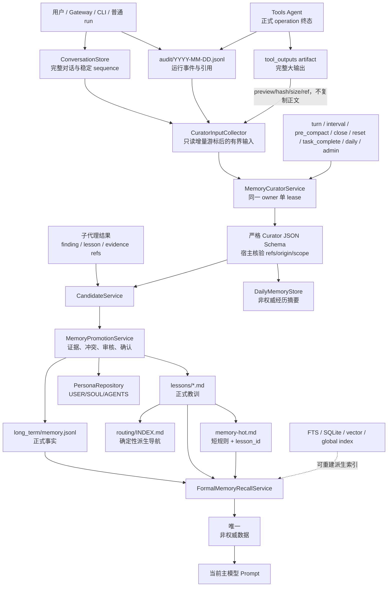

# Memory Structure

本文描述 Memory v2 的当前生产主链。Compact、ConversationStore、Audit 和 Tools 各自保持独立权威；Memory 只通过 typed ID、ref、schema 和状态与它们集成。

## Owner Home

```text
owner_home/
|-- SOUL.md
|-- USER.md
|-- AGENTS.md
|-- memory-hot.md
|-- memory.md
|-- retention.json
|-- memory/
|   |-- long_term/
|   |   `-- memory.jsonl
|   |-- daily/
|   |   `-- YYYY-MM-DD.jsonl
|   |-- candidates.jsonl
|   |-- ops.jsonl
|   |-- migration.json
|   |-- curator/
|   |   |-- state.json
|   |   `-- runs/YYYY-MM-DD.jsonl
|   |-- lessons/
|   |   `-- *.md
|   `-- routing/
|       `-- INDEX.md
|-- audit/
|   `-- YYYY-MM-DD.jsonl
|-- tasks/<date>/<task-slug>/
|   |-- output/
|   `-- work/
|       `-- blobs/tool_outputs/
|-- compact/
`-- global_index/
```

`retention.json` 和 `memory/migration.json` 是维护合同/marker，因此补充在目标树旁；它们不属于可召回正文。

## 完整数据流



## 文件唯一职责

| 路径 | 唯一职责 | 明确不负责 |
| --- | --- | --- |
| ConversationStore | 完整用户/AI消息、`message_id/thread_id/role/content/created_at/channel/sequence` | 不替代 Candidate、Daily 或正式长期记忆 |
| `audit/YYYY-MM-DD.jsonl` | 消息、工具、派工、错误、hash 和 ref 的运行黑匣子 | 不保存完整对话权威，不做候选状态机 |
| `tasks/.../work/blobs/tool_outputs/` | 大工具输出完整正文 | 不因模型总结而获得事实权威 |
| `memory/long_term/memory.jsonl` | active 具体事实、事件、项目知识及版本/tombstone | 不保存 lesson、Persona、Candidate 或完整对话 |
| `memory/daily/YYYY-MM-DD.jsonl` | Curator 每日经历摘要及来源 ref | 不镜像 long-term 操作，不直接进入正式召回 |
| `memory/candidates.jsonl` | 唯一候选当前态、观察幂等键、状态历史、审核和晋升 ref | 不被 Prompt 召回，不成为正式事实 |
| `memory/ops.jsonl` | 不含正文的正式 Memory 操作审计 | 不保存候选正文，不参与召回 |
| `memory/curator/state.json` | 增量游标、pending reason、lease、计数、成功/失败状态 | 不保存模型正文或第二套 Gateway 内存游标 |
| `memory/curator/runs/*.jsonl` | 每次后台运行的 provider/model、数量、游标、失败码和恢复审计 | 不复制输入、Candidate 或 Daily 正文 |
| `memory/lessons/*.md` | 正式 lesson 唯一详细正文及程序 metadata marker | 不与 long-term 的 `kind=lesson` 双写 |
| `memory/routing/INDEX.md` | 按正式 lesson 元数据确定性生成的导航 | 不是教训正文，不由模型自由重写 |
| `memory-hot.md` | 高频稳定短规则、正式 `lesson_id` 和 `lesson_ref` | 不复制 lesson 详细正文，不接收单次经验 |
| `memory.md` | 极短导航和维护入口 | 不保存事实、候选或大段教训 |
| `USER.md` | 当前用户明确表达的稳定画像/偏好 | 不保存本轮临时要求或模型推断 |
| `SOUL.md` | 经用户确认的 AI 人格 | Curator 不可直接写 |
| `AGENTS.md` | 经用户确认的长期合作方式 | Curator/子代理不可直接写 |
| `retention.json` | Memory v2 保留期、legal hold 和维护节流的 typed policy | 不从自然语言判断删除目标 |
| `memory_policy.json` | Memory 总闸(memory-policy.v1.enabled)；缺失/损坏视为开启 | 不直接由消费点读原始 JSON，不定义细粒度来源名单 |
| `skill_policy.json` | Skill 总闸(enabled) + enabled_sources 等细粒度名单 | 总闸关闭时名单无意义(快照直接空) |
| `memory/migration.json` | 一次性迁移完成 marker 和备份引用 | 不提供永久 legacy fallback |

## 生产服务与调用关系

- `memory_store/candidates.py`：唯一 CandidateService，负责稳定 `candidate_id`、观察去重、`occurrence_count` 和状态转换。
- `memory_store/daily.py`：唯一 DailyMemoryStore，在文件锁内重读、校验、去重并分配 `previous_event_id/sequence`。
- `memory_store/curator.py`：统一后台策展入口；所有触发只提交 reason，再由同一服务获取 owner lease、读取增量输入、调用后台模型并提交批次。
- `memory_store/curator_inputs.py`：只读 ConversationStore、owner audit 和 runtime-memory control plane 的有界 tool-output 元数据；只把精确 `artifact_ref/hash/size` 绑定到同 `run_id/tool_call_id`，不读取大输出正文，也不把 output index 当工具成功终态权威。
- `memory_store/curator_commit.py`：把 Daily、Candidate、run audit、state 作为一个可恢复事务提交；state 最后写，失败不推进 cursor。
- `memory_store/promotion.py`：唯一正式晋升服务；回查 ConversationStore/Tools 权威，裁决冲突并调用正式 repository。
- `memory_store/lessons.py`：正式 lesson/HOT repository 和 deterministic routing rebuild。
- `memory_store/recall.py`：只召回 active long-term、正式 lesson 和正式 HOT；索引命中必须回查当前权威。
- `memory_push.py`：planner/runner 关键决策点的主动召回适配；只读正式 Lesson/HOT，仍通过同一个 `<memory-context>` 投影，不再定义 lesson 类型或写入函数。
- `memory_store/migration.py`：只负责一次性 v2 迁移，默认 dry-run，apply 前完整备份并在失败时恢复。
- `memory_store/retention.py`：组合 typed planner/apply；apply 必须重新规划并逐项重验证。
- `memory_store/lifecycle.py`：将 session close/reset 变成结构化 Curator 请求，不直接提炼或写长期记忆。
- `agent/memory_api.py`：CLI 与外层包使用的公开 Memory façade，只重新导出正式 Service/DTO；它不保存
  状态、不实现第二套业务逻辑。`core.py` 仍是 composition root，并在这里把 Tools 控制面的只读
  `ToolReferenceQuery` 注入 `CuratorToolReferenceSource`，Memory 子包不反向导入 `memory_archive`。
- `capability/memory_tool.py`：模型侧唯一 `remember` 工具；正式事实仍走 Candidate + Promotion。
- `capability/persona_tool.py`：模型侧唯一 Persona 工具，写入由 PersonaRepository 控制。
- `user_space/owner_policy.py`：`resolve_effective_owner_policy` 把 memory/skill 两个 policy 文件投影为
  `EffectiveOwnerPolicy.memory_enabled/skills_enabled` 的单一 effective flag；所有消费点(curator 调度、
  发现层判活、决策点召回、remember 工具 availability、skill 快照)只认该 flag，缺失文件视为开启，
  子代理 and 继承父开关。关闭时消费点全部短路(不碰 LLM、不占登记表工位、快照为空)。
- `cli/memory_admin_parser.py` 与 `cli/memory_admin_commands.py`：管理员统一入口，只委托上述 Service。

## Curator 提交与崩溃恢复

1. trigger 将固定枚举 reason 写入 `state.json.pending_reasons`，并递增该 reason 的 `pending_reason_generations`。
2. Curator 在 owner 范围获取带过期时间的 lease；同一 owner 同时只有一个 active lease，lease 同时冻结本次 reason generation。
3. 只读取 cursor 之后的 ConversationStore/audit，并对输入字符数和消息数做上限。
4. 后台模型只有 `generate` 能力，没有 tool loop；响应必须是一个完整 JSON 对象。
5. 宿主核验模型声称的 message/tool/task/run ref 是否真的在本批输入或正式事实源中。
6. 提交器先准备四个目标的最终内容与 backup manifest，再按 Daily、Candidate、run audit、state 顺序提交。
7. 任一关键步骤失败都会恢复已写目标、释放/过期处理 lease、记录稳定错误码，且不推进消息或 audit cursor。
8. 成功只消费 lease 冻结的那一代 reason；运行期间到达的不同 reason，或同一 reason 的新一代请求，都会继续留在 state，不能被先完成的批次抹掉。
9. Gateway 重启后，owner wake discovery 会发现 pending reason、过期 lease、未处理 ConversationStore/audit 或未完成 daily finalize，并回到同一服务。

## Promotion 与 Persona 边界

- `user_explicit` 必须由当前 owner ConversationStore 核验真实用户消息、quote 与 SHA-256。
- `tool_verified` 必须由 Tools Agent 的 operation store 核验 `succeeded + ok=true + effect_outcome` 已知。
- `model_inferred`、`subagent_finding`、`subagent_lesson` 不能绕过审核或 PersonaRepository。
- 自动晋升只适用于证据完整、无冲突、动作是 add 的新 user/tool 长期事实。
- replace/remove/merge、lesson、HOT、USER 范围歧义、SOUL、AGENTS 都必须审核或确认。

## Recall 与 Prompt 安全

- 查询先取当前 owner 的正式记录，再按文本相关度、来源可信度、更新时间和结构化 scope 排序。
- `subject_key + scope_type + scope_key` 去重；新时间不会自动压过旧事实。
- candidates、ops、Daily、rejected、superseded、expired 与 stale index 不进入正式 Prompt。
- 所有历史记忆只通过一个 `<memory-context>` 注入；信封声明其为非权威数据。
- planner 与 runner failure 的主动教训召回也遵守同一条；routing Markdown 只产生读取小票，不把 `### Routed memory authority` 原文作为第二种注入。
- 当前用户消息、当前代码/文件和最新工具结果优先；用户出口会剥离完整或截断的内部信封。

## 跨模块边界

- Tools Agent 拥有工具 schema、注册、执行、operation 状态和结果协议。Memory 只实现 `ToolEvidenceVerifier` 适配器，并通过现有 runtime-memory control plane 读取 artifact 路径/hash/size；后者只补引用，不能证明工具成功，也不复制状态机。
- Audit Agent 拥有 audit 生命周期、事件摄取和 ConversationStore 高冲突主链。Memory 只读取 typed refs/cursors，并通过最小接口请求生命周期触发。
- Gateway 拥有后台维护循环。Memory 复用该循环，不启动第二个 daemon。
- Compact 拥有上下文缩减。Memory 只接收 `pre_compact` 请求，不把 Compact 摘要当正式事实。
