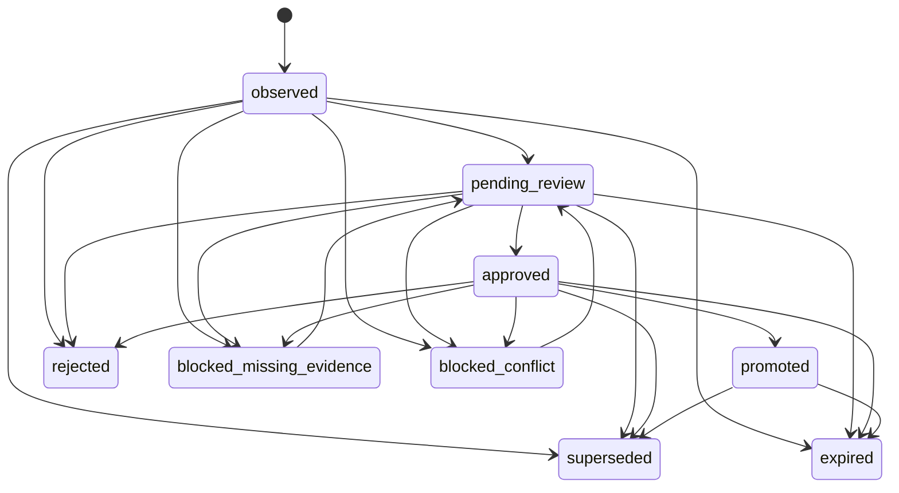

# Memory V2 Schema 与字段说明

本文解释持久化协议中的英文字段。字段名保持稳定用于机器处理，中文说明用于开发、审核和运维；不能用中文正文反推机器状态。

## Candidate：唯一候选账本

文件：`memory/candidates.jsonl`。一行表示一条候选的当前态，并内含状态历史；它不是正式记忆。

| 字段 | 中文含义 |
| --- | --- |
| `schema_version` | 候选 Schema 版本，当前为 `my-agent.memory-candidate.v2`。 |
| `candidate_id` | 由类型、正文、主题、scope、动作和目标生成的稳定候选编号；同一语义重放不新建第二条。 |
| `candidate_type` | 候选类型，决定它可能进入长期事实、lesson、HOT 或 Persona 的哪一类。 |
| `content` | 短小、自包含的候选正文；最多 2000 字符，不能承载完整对话或工具大输出。 |
| `content_hash` | 正文哈希；候选过期/删除正文后仍可审计而不保留明文。 |
| `content_redacted_at` | 正文按 retention 清除的时间。 |
| `subject_key` | 稳定主题键，例如 `device.os`；同主题同 scope 的不同内容会触发冲突检查。 |
| `scope` | 结构化适用范围对象，含 `scope_type/scope_key/applies_when/excludes_when`。 |
| `origin` | 来源类别，不同来源拥有不同证据和晋升权限。 |
| `evidence_refs` | 通用结构化证据引用，只含 ID/ref/hash/preview 等有界字段。 |
| `source_message_refs` | 用户/AI消息引用；`user_explicit` 必须由 ConversationStore 回查。 |
| `source_tool_refs` | 工具 operation/call 引用；`tool_verified` 必须由 Tools 权威回查成功终态。 |
| `source_artifact_refs` | 大内容 artifact 引用，可含 hash、size、preview，不含正文。 |
| `source_task_ids` | 来源任务 ID 列表，用于独立证据分组和追溯。 |
| `source_run_ids` | 来源运行 ID 列表，用于独立证据分组和追溯。 |
| `observed_at` | 第一次业务观察发生时间。 |
| `last_observed_at` | 最近一次独立观察时间；只用于审计，不自动决定真假。 |
| `valid_from` | 事实适用的开始时间。 |
| `valid_until` | 事实失效时间；temporary 候选应明确填写或使用临时 scope。 |
| `occurrence_count` | 独立 observation 数；重复相同事件不会增加。 |
| `confidence` | 模型提炼置信度，仅供审核参考，不能代替证据。 |
| `proposed_action` | 建议正式动作：add、replace、remove、merge 或 none。 |
| `target_entry_id` | replace/remove/merge 或 HOT 所指向的精确正式记录 ID。 |
| `conflicts_with` | 与之冲突的正式 entry ID 列表；未解决时不能静默晋升。 |
| `promotion_target` | 建议正式落点：user、long_term、lesson、hot、soul、agents 或 none。 |
| `status` | 唯一候选状态机中的当前状态。 |
| `reviewer` | 最近审核者标识。 |
| `review_note` | 审核说明，只供人读，不参与机器判定。 |
| `created_at` | 候选首次创建时间。 |
| `updated_at` | 最近一次结构化变更时间。 |
| `promoted_at` | 正式晋升时间。 |
| `promotion_ref` | 最终正式落点的路径和精确 ID。 |
| `observation_keys` | 已计数观察的稳定去重键，保证失败重放/重启不虚增次数。 |
| `status_history` | 同一状态机中的转换历史，不是第二份 decision ledger。 |

### Candidate 枚举

`candidate_type`：

- `user_profile`：用户画像事实。
- `user_preference`：用户稳定偏好。
- `long_term_fact`：可跨会话复用的具体事实。
- `event`：值得长期追踪的事件。
- `project`：项目知识、约束或位置。
- `lesson`：可复用教训候选。
- `hot_rule`：从正式 lesson 晋升的短规则候选。
- `soul_change`：AI 人格变更候选。
- `working_agreement`：长期合作约定候选。
- `discard`：明确不应长期保存的提议。

`origin`：

- `user_explicit`：当前用户明确表达，必须有真实用户消息证据。
- `tool_verified`：正式成功工具 operation 核验出的事实。
- `model_inferred`：模型推断，永远只具候选权威。
- `subagent_finding`：子代理 finding。
- `subagent_lesson`：子代理 lesson。
- `reviewed`：宿主/管理员已审核形成的衍生候选，例如 HOT。
- `migrated_legacy`：由一次性迁移从旧数据保全而来，仍需按策略审核。

`scope_type`：

- `global`：当前 owner 的所有场景。
- `personal`：个人场景，例如个人电脑。
- `company`：公司/组织场景。
- `project`：精确项目，例如 `project:moneywise`。
- `task_class`：一类任务，例如 `task_class:engineering`。
- `session`：只在一个 session 内适用。
- `temporary`：一次性或有期限要求，不得沉淀为全局 USER 偏好。

`status`：

- `observed`：已观察，尚未进入审核。
- `pending_review`：待审核。
- `approved`：已审核批准，但尚未写入正式落点。
- `promoted`：已由 PromotionService 写入正式落点。
- `rejected`：已拒绝终态。
- `superseded`：已被更准确候选替代终态。
- `expired`：已过期终态。
- `blocked_missing_evidence`：证据不足，可补证后回到待审核。
- `blocked_conflict`：存在未解决冲突，可明确目标后回到待审核。

### 唯一状态机

禁止 observed 直接写正式存储，也禁止 rejected/superseded/expired 回到 active 状态。

## DailyMemoryEvent：每日经历摘要

文件：`memory/daily/YYYY-MM-DD.jsonl`。顺序由 host 在文件锁内分配，不依赖时间字符串排序。

| 字段 | 中文含义 |
| --- | --- |
| `schema_version` | Daily Schema 版本，当前为 `my-agent.daily-memory.v2`。 |
| `event_id` | 根据来源身份与事件内容生成的稳定 ID，失败重放不会变化。 |
| `previous_event_id` | 同一日账本上一条 event ID，首条为空。 |
| `sequence` | 同一日从 1 开始连续递增的权威顺序。 |
| `event_type` | conversation、decision、task_progress、tool_result、lesson、todo、summary、warning 或 error。 |
| `summary` | 1 到 1500 字符的有界经历摘要，不是完整对话。 |
| `actor` | user、main_agent、subagent、tool 或 system。 |
| `origin` | user_explicit、tool_verified、model_inferred、subagent_finding 或 reviewed。 |
| `session_id` | 来源会话 ID。 |
| `thread_id` | 来源对话线程 ID。 |
| `request_id` | 来源请求 ID。 |
| `task_id` | 来源任务 ID。 |
| `run_id` | 来源运行 ID。 |
| `message_refs` | ConversationStore 消息引用，不复制消息正文。 |
| `tool_refs` | 工具 operation/call 引用，不复制工具正文。 |
| `artifact_refs` | 工具大输出/产物引用及有界元数据。 |
| `decisions` | 本次经历中的短结构化决定列表。 |
| `lessons` | 本次经历中发现的短教训描述；它仍不是正式 lesson。 |
| `next_actions` | 可续接的短动作列表，不承担任务状态权威。 |
| `created_at` | 原始经历发生时间。 |
| `extracted_at` | Curator 提炼时间。 |
| `curator_run_id` | 生成此事件的正式 Curator run ID。 |

Daily 只能通过检索、恢复或后续策展按需读取；它不默认整批进入 Prompt，也不能因被写入 daily 就自动成为长期事实。

## Curator State 与输出

`memory/curator/state.json` 字段：

| 字段 | 中文含义 |
| --- | --- |
| `schema_version` | Curator state 版本。 |
| `last_processed_message_id` | 已成功提交批次覆盖的最后消息 ID。 |
| `last_processed_audit_event_id` | 已成功提交批次覆盖的最后 audit event ID。 |
| `per_thread_cursors` | 每个 thread 的精确消息游标。 |
| `last_run_at` | 最近尝试运行时间。 |
| `last_success_at` | 最近成功提交时间。 |
| `last_failure_at` | 最近失败时间。 |
| `last_failure_code` | 最近稳定错误码，例如 Schema、模型、超时或提交失败。 |
| `active_lease` | 当前 owner lease 的 run ID、holder、generation 和过期时间。 |
| `processed_count` | 累计成功处理消息数。 |
| `candidate_count` | 累计提交候选数。 |
| `daily_event_count` | 累计提交 Daily 事件数。 |
| `config_revision` | 当前 Curator 配置的稳定哈希。 |
| `pending_reasons` | 尚待消费的固定触发原因列表。 |
| `pending_reason_generations` | 每种 reason 已收到的耐久代数；同一 reason 在运行期间再次到达时不会被旧 lease 的成功提交误清除。 |
| `pending_requested_at` | 最近请求触发时间。 |
| `last_daily_finalize_date` | 最近已完成每日收尾的日期。 |
| `last_committed_run_id` | 最后成功整批提交的 Curator run ID，用于崩溃恢复判定。 |

后台模型输出 Schema 当前为 `my-agent.memory-curator-output.v3`，顶层必须且只能包含：

- `schema_version`：输出 Schema 版本。
- `daily_events`：不含 host-owned ID/sequence 的 Daily 草稿。
- `candidates`：不含 `candidate_id/status/reviewer/evidence_refs/observation_id` 的候选草稿；后两项由宿主从真实证据生成。
- `processed_message_refs`：模型声明已处理的消息 ref，宿主会与真实输入核对。
- `processed_audit_refs`：模型声明已处理的 audit ref，宿主会核对。
- `unresolved_refs`：无法安全解释、需要后续处理的 ref。
- `warnings`：有界人类提示，不参与控制流。
- `next_cursor`：模型建议游标；最终 cursor 由宿主根据真实输入计算。

模型只提交最小引用选择键：消息引用只含 `message_id`，工具引用只含 `event_id`，大内容引用只含 `artifact_ref`，processed 引用只含所属流的 ID。宿主再从当前 owner 的冻结 ConversationStore/audit 批次补全 role、逐字连续 quote、完整正文 content_hash、status、operation、task/run 和路径，并据此生成 Candidate 的 `evidence_refs` 与稳定 observation identity。对于已外置的大工具输出，宿主通过现有 runtime-memory control plane 按精确 `run_id + tool_call_id` 补全 `artifact_ref/content_hash/size_bytes`，且丢弃 parameters、source input 和正文；这个投影只提供引用，不替代 Tools operation store 的成功终态核验。这样既缩短真实模型输出，也彻底取消模型伪造 quote 或权威元数据的权限。`unresolved_refs` 同时声明 nullable `message_id/event_id`，但宿主强制恰好一个非空。

任何代码块包裹、前后自然语言、未知字段、伪造 ref 或 host-owned 字段都会得到稳定 Schema/validation 错误，不能从文本中猜测补全。

## Promotion 结果与规则

`MemoryPromotionResult` 字段：`candidate_id` 表示本次候选；`promoted` 是是否已正式落盘；`status` 是候选最终状态；`reason_code` 是机器判定码；`promotion_ref` 是正式落点。

保守自动晋升只允许同时满足以下条件的新 `long_term` add：

- origin 是 `user_explicit` 或 `tool_verified`；
- 精确证据可回查且属于当前 owner；
- `subject_key` 与 scope 完整；
- 没有同 subject/scope 冲突；
- 不涉及 replace/remove/merge、Persona、lesson 或 HOT。

以下必须人工审核或明确确认：

- replace、remove、merge；
- USER 适用范围有歧义；
- SOUL、AGENTS；
- model/subagent 推断；
- lesson、HOT 与 Skill 候选。

## Lesson、Routing 与 HOT

- `LessonRecord` 保存 `lesson_id/candidate_id/subject_key/scope/occurrence_count/evidence_groups/source_task_ids/source_run_ids/created_at/updated_at/status/path`，详细正文只在同一 lesson Markdown 中出现一次。
- 普通 lesson 默认需要 approved、明确证据、至少 2 次观察且来自至少 2 个独立 task/run/date；用户明确要求长期记住该教训时可作为显式例外。
- `routing/INDEX.md` 只根据正式 LessonRecord 排序和渲染；同一输入重复 rebuild 必须字节一致。
- `HotRuleRecord` 保存 `hot_id/candidate_id/lesson_id/lesson_ref/rule/occurrence_count/evidence_groups/promoted_at`。
- HOT 默认至少 3 次观察、至少 2 个独立证据组、无冲突、目标为精确 active `lesson_id`，且规则不超过 300 字符。
- HOT 文件只显示短规则和 lesson ref；正式 lesson 详细正文不会复制进去。

## Retention Policy 与动作字段

文件：`retention.json`，Schema 为 `my-agent.memory-retention.v2`。

| 字段 | 默认值 | 中文含义 |
| --- | ---: | --- |
| `conversation_days` | 365 | 完整 ConversationStore 会话保留天数。 |
| `audit_days` | 180 | audit 日志保留天数。 |
| `daily_days` | 365 | Daily 经历摘要保留天数。 |
| `tool_output_days_after_terminal` | 30 | 任务进入结构化终态后工具大输出的保留天数。 |
| `rejected_candidate_days` | 30 | rejected 候选保留天数。 |
| `curator_run_days` | 90 | Curator run audit 保留天数。 |
| `compact_days` | 365 | Compact 记录保留天数。 |
| `completed_task_days` | 365 | 完成任务目录保留天数。 |
| `cache_days` | 30 | 可重建缓存保留天数。 |
| `tmp_days` | 7 | 临时文件保留天数。 |
| `trash_days` | 30 | 可恢复回收站内容保留天数。 |
| `subagent_scratch_days` | 30 | 子代理 scratch 数据保留天数。 |
| `legal_hold` | false | owner 全局 legal hold；为 true 时任何删除都不执行。 |
| `legal_hold_task_ids` | `[]` | 单独受 legal hold 保护的 task ID。 |
| `maintenance_enabled` | true | 是否允许 Gateway owner maintenance 自动运行。 |
| `maintenance_interval_seconds` | 86400 | 同 owner 自动维护的最小间隔秒数。 |

Retention plan 中每个 action 还保存稳定 `action_id/category/operation/path/status`，以及执行前重验证所需的 `authority_path/authority_status/authority_fingerprint/source_fingerprint/record_id/cutoff_timestamp/related_paths`。`reason` 只供人读，不能决定删除。
